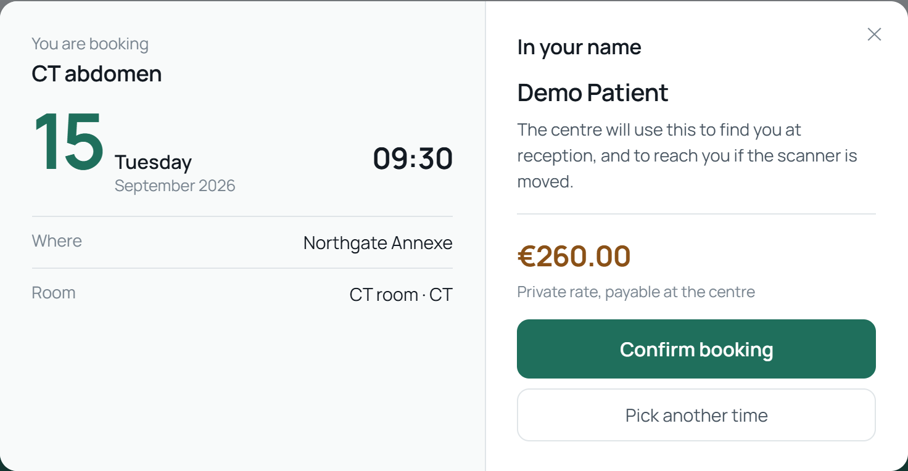

# Multi-tenant booking

A booking platform for a group of diagnostic centres. Patients book online,
the desk works the day's diary, and whoever runs the platform brings a new
centre into existence from a console, while the others keep taking bookings.

The interesting part is the last one, and what this demonstrates. Routing three
centres that already exist is a middleware; **creating the fourth, at runtime,
with its own database, is where a multi-tenant system is actually decided**.


## Before you start

**Docker, with the Compose plugin.** That is the whole list. PostgreSQL, the
API and the interface all run in containers, so there is no database to
install, no Angular CLI, no account anywhere and no key.

To run the tests or work on it, **Node.js 20.11 or newer**.

About 400 MB of images and packages, once. Nothing is persisted outside
Docker: the databases live and die with the container, so every start is a
clean one.

## Running it

```
git clone https://github.com/riccardosapuppo/multi-tenant-booking.git
cd multi-tenant-booking
npm start
```

That is `docker compose up --build`, waiting, and then your browser on the
sign-in page. The waiting is the part worth having: the compose output never
ends, so nothing in it says "now", and a first start that is opened too early
shows the sign-in screen of an API still creating the register. What it waits
for is `/api/health`, which answers 503 until the register exists and the three
centres are in it — and the web container answering as well, since that is
where the browser is sent.

`npm start -- --no-open` leaves the browser alone. `docker compose up --build`
still does exactly what it always did, for anyone who would rather watch it.

If port 3000 or 4200 is already taken (3000 is what every other development
server also wants), set your own — `npm start` reads the same two variables the
compose file does:

```
API_PORT=3001 WEB_PORT=4300 npm start
```

`docker compose down` stops it and takes the data with it.

**To put the machine back completely:** `docker compose down -v` removes the
volumes too, and `docker image rm multi-tenant-booking-api multi-tenant-booking-web
postgres:16-alpine` removes what was built and pulled, together about 700 MB
and the part that deleting the clone does not reach. Nothing is installed
globally; the three images and one volume are the whole footprint.

## Signing in

Four accounts. They are on the sign-in page as buttons, so you can move
between them in a click, and they are printed here because **the difference
between them is the demonstration**. They open a database created empty on
your machine and thrown away with the container.

| Account | Email | Password | What it shows |
|---|---|---|---|
| Patient | `patient@example.invalid` | `patient-demo-1234` | Books at either centre; sees only their own bookings |
| Staff | `staff@example.invalid` | `staff-demo-1234` | The desk at Northgate **and** Riverside, and nothing at Lakeside |
| Centre administrator | `admin@example.invalid` | `centre-admin-demo-1234` | Northgate's desk, and may change its price list |
| Platform administrator | `platform@example.invalid` | `platform-admin-demo-1234` | Creates and suspends centres — and cannot read a single patient booking |

The last row is not an omission. Administering the platform is not permission
to read every record on it, so `platform_admin` is a different job from
`centre_admin` rather than a bigger one. Sign in as it and try the desk: the
API returns 403.

Every claim in that table is checked by `npm run check:roles`, which drives
each account through what it is promised **and** through what it is promised it
cannot do. One of those rows used to be false; see *Checking it*.

### Four accounts, four applications

The header is where a role becomes visible, and it changes completely: its
colour, what it offers, and where signing in puts you. One service, one login,
and the boundary between these four people is a permission rather than four
deployments.

<p>
  <br />
  <br />
  <br />
  
</p>

Read from the top: the patient books and looks at their own appointments; staff
open on today's diary and book on somebody's behalf; the centre's administrator
has the price list as well; and whoever runs the platform has centres and
*nothing else* — no centre selector, because they belong to none, and the word
under the mark says **no centre**.

## What it looks like

Booking, in the shape the original asked the question: panels that open one at
a time, each showing its answer once closed. Several exams go into one visit
("Add another exam"), and the payment category is asked *before* the times,
because it changes which times exist.


The first question is **where**, and it is first for a reason that only shows
if the sites are allowed to differ. A group of diagnostic centres does not put
an MRI in every building: the scanner is the expensive thing and it lives in
one place, while an X-ray point can sit in a high street. So Northgate has
three sites -- MRI and X-ray in the main one, CT and ultrasound in the annexe,
X-ray alone at the point, open late all week -- and the panel says which
machines are in each, next to the address. It used to say "Site: Any" and
nothing else, which tells somebody who has just chosen a centre neither what a
site is nor that this centre has three.

That is also what makes two exams in one visit a real question rather than a
checkbox. One appointment happens in one room, so an ultrasound and an X-ray at
Riverside are two journeys: the ultrasound is down the road. The search says
so, in those words, instead of returning nothing.

The answer opens over the question that asked for it, and it is **days** rather
than slots: a card per day with the date large, the total price for everything
asked for, the site, and the times beside it. Each day also carries a bar
showing how much choice it offers next to the others: with eight days on
screen the useful question is not "is this one free" but "which of these leaves
me room to change my mind".


Picking a time does not book it. It used to -- one click, no summary, no way
back, and the name on the booking was a constant in the source called
`Demo Patient`, so the screen could not tell you whose appointment it had just
made. What a time opens now is the appointment itself: the day and the hour
large, the site, the room and the machine, and the price beside the button that
agrees to it.



The right-hand half changes with who is asking. A patient sees their own name.
Somebody at the desk is booking for the person standing in front of them, so
the name is a field and it is required -- that is where `Demo Patient` came
from. And a visitor with no account sees what an account is for.

### Booking without an account, and then having one

A booking screen that asks for a password before it will show you a single free
slot is a screen most people close. So the search is open: choose a centre,
choose an exam, see the times. The account is needed at the end, for the reason
an account is ever needed here -- an appointment belongs to somebody, and the
centre has to be able to ring them when a scanner breaks.

So the last step sends a visitor to register, with the time they picked kept
beside the form, and brings them back to it afterwards with one button left to
press. The registration asks for six things, and says next to each why it wants
it. The original asked for eleven, because an Italian health service identifies
a patient by tax code and birth date rather than by an email address; the five
that went were the ones a form asks in order to *compute* the tax code, and
this one lets you type it instead.

Nothing is held while that happens, and the confirmation says so rather than
implying otherwise: a hold with an expiry is a real feature, not a
demonstration of one. If the time goes in the meantime the booking comes back
409 and the screen says it has just been taken, and shows what is left.

And on a phone, where the header becomes two rows and drops the account name:
somebody knows who they signed in as; what they need is which centre they are
looking at.

<p>
  
  
</p>

The desk, which is behind a role at that centre. The totals along the top are
per payment category, because that is what the quotas are counted in:


And the price list, which **only** the centre's own administrator can open.
Staff at the same centre read the desk and are sent back to it. None of the
three columns is just a number: minutes is how long a slot is, so changing it
re-cuts every day on the booking screen; *offered online* takes an exam off
what patients are shown and leaves it here; and the price is what somebody is
quoted before they choose a time.


## The five minutes worth spending

1. **Sign in as the patient** and book something at Northgate. Then switch
   centre in the header and look at *My bookings*: it is empty. Nothing was
   filtered out: the booking is in another database and was never fetched.
2. **Sign in as staff.** The *Desk* link appears. Switch to Lakeside and it
   goes: the same account, the same token, a different centre.
3. **Book as an exempt patient at Riverside.** Its morning allows one, so the
   second attempt says the quota for that category is used up, and offers the
   same morning to a private patient. Quotas per payment category are what the
   people at the desk actually manage, and most demonstrations model them away.
4. **Sign in as the platform administrator and create a centre.** It gets a
   database, a schema and a register entry, and answers immediately:

   ```
   curl -H 'X-Centre: eastgate' http://localhost:3000/api/centre/exams
   ```

   No restart, no configuration file, and the other centres never paused.

## How a centre is decided

One shared database holds identity and the register. One database per centre
holds everything clinical. That split is the original's and it is deliberate:

- **A person has one account** and books at whichever centre they like.
  Identity per centre would mean registering again at each one.
- **A query cannot forget its filter** when there is nothing else in the
  database to return. Isolation by `WHERE centre_id = ?` is one missing clause
  away from a leak, and nothing lists the places it has been forgotten.

The cost is real and is not hidden: a schema change has to reach every centre,
and a report across centres has to visit each one. `provision.js` exists
because of the first, and the console pays the second on purpose.

Which centre a request is for is resolved once, at the front, from a header, a
subdomain or a query parameter:

```
curl -H 'X-Centre: northgate' http://localhost:3000/api/centre/exams
curl 'http://localhost:3000/api/centre/exams?centre=riverside'
```

**If two of them disagree the request is refused**, not resolved. A header
naming one centre and a hostname naming another is a misconfiguration or an
attempt, and picking one silently is how a booking lands in the wrong centre's
database.

A suspended centre answers 403 and an unknown one 404, different on purpose,
since a platform that returns the same for both lets anybody enumerate its
centres.

## One application, four jobs

The original had two deployments: a portal, and a separate console for whoever
ran the platform. Separating the jobs was right; separating the *applications*
hid the thing worth showing, which is that the boundary between them is a
permission and not a URL.

So this is one Angular application whose navigation is built from what the
signed-in account may actually do, at the centre it is currently looking at.
Watch the *Desk* link appear and disappear as you switch centres: that is what
"a role is always at a centre" means, and it is more convincing than a
paragraph about it.

Putting them in one application only shows that, though, if signing in as
somebody else visibly changes the application; at first it did not.
Everybody got the same two links plus perhaps a third, the role was a word
inside the centre selector, and signing out and back in as an administrator
looked identical. So three things move together with the role now: the colour
the header wears, the set of links (not the same links with some hidden: a
patient has *My bookings*, staff *book for a patient*), and where signing in
puts you, because staff do not open this to book themselves an appointment.

The colour had to become the band itself. It started as two pixels of rule
under a white header, then as white tinted 9% towards the role -- and on a page
that is already near-white, that is a header separated from its own content by
a border and nothing else. It is a dark band now, tinted a quarter of the way
towards whichever colour the account is here: four roles, four recognisably
different headers, and none of them a saturated stripe, because a fully
role-coloured bar reads as a warning at orange and as a toy at purple.

## Checking it

```
npm test                     # the rules, and the isolation once the database is up
npm run walkthrough          # drives the running platform over HTTP
npm run check:screen         # drives the whole journey through a browser
npm run check:roles          # every account against every claim made about it
npm run check:serving        # nothing here can hand somebody yesterday's build
npm run check:mark           # the header mark and the tab icon are one drawing
```

**Two** of those scripts, `check:screen` and `check:roles`, drive a browser and
want `playwright-core` on the path; they say so and stop rather than pretending
to have passed. `check:serving` and `check:mark` do not: one reads response
headers and the other compares two drawings, and neither needs a browser for
that. All four are checks rather than dependencies, so none of them is in
`package.json` -- an `npm install` that fetched 300 MB of browser before you
could run the thing would make the list at the top of this page false.

Which left them run nowhere by default, and a check nobody runs is a paragraph.
So CI runs them: the job that brings the whole stack up with `docker compose`
then installs a browser, drives the journey and every role against it, and
throws the machine away. Locally they drive the Edge that is already on the
machine; `PLAYWRIGHT_CHANNEL` chooses otherwise, and empty means whatever
Playwright brought with it, which is what CI sets.

The suite covers the rules (quotas, slot cutting, weekday patterns) and creates
two centres of its own to check that neither can see the other. Those eight
need PostgreSQL, so run `npm start` first — or `docker compose up -d postgres`,
which is enough on its own. They use slugs of their own and remove only those,
so they can run against a demonstration you are in the middle of looking at.

Until recently they could not run here at all: the compose file kept PostgreSQL
to itself, nothing on the machine could reach it, and the eight skipped on
every clone. That is worth saying because of how it looked — `ok ... # SKIP`,
then "20 passed, 0 failed" — which reads as a green suite covering the claim
this project exists to make, while the part that covers it had not run. The
port is published now, and when they still cannot run they say so in three
lines nobody can mistake for a pass. CI brings its own database, and then
checks that nothing skipped.

`npm run walkthrough` is the check that is **not** written behind the same door
as the code. The suite calls the functions directly and was written alongside
them, which makes it good at saying they still do what they did and blind to a
route mounted in the wrong place or a permission check on a router that never
runs. This drives the running platform through the whole story — resolving,
booking, isolation, permissions, provisioning — and states what should happen
before each step, so a failure reads as a sentence:

```
A role is never enough on its own
  ok    a patient cannot read the diary
  ok    staff can read the diary where they work
  ok    and not at a centre they do not work at
  ok    the platform administrator cannot read a patient diary
```

### And a check at one layer cannot see the next one down

Three layers, because each is blind to the one above it, and every one of them
has caught something the others could not.

`npm run check:screen` drives the whole journey with a browser: a patient books
and reads the reference off the screen, signs out, and staff sign in and find
that appointment on the desk with the right name, time, room and category.
Everything it does the walkthrough already does over HTTP, and that is a
different claim. The API behaving is not somebody being able to do it. It found
three screens that did not reload when the centre was switched, so one centre's
appointments sat under another centre's name, and a centre that survived
signing out.

`npm run check:roles` takes the table under *Signing in* and treats it as a
promise. It found the row that was false: it said the centre's administrator
"may change its price list", and `PATCH /desk/exams/:id` existed, was guarded
correctly and had a passing test, but no screen anywhere called it. True of the
system, false of the interface, which is the only place a person can act.

`npm run check:serving` is about what a browser is handed. An earlier version
of this project installed a service worker; a service worker outlives the build
that registered it, is reached before the network, and keeps serving its own
precached copy, so opening the site returned a page from weeks ago and only
Ctrl+F5 got past it. The way a browser gives up on one is by re-fetching its
files and finding them gone, and `try_files $uri $uri/ /index.html` answered
`/ngsw.json` with 200 and a page of HTML. **A request that names a file and
does not find one must be a 404, never the application.**

## Where things are

```
backend/
  tenants/      the register, resolving a request to a centre, and provisioning
  db/pools.js   the only file that turns "which centre" into "which database"
  auth/         passwords, sessions, and permissions that always carry a centre
  booking/      availability as pure functions, and the diary
  centre/       the desk: behind a role at this centre
  platform/     the console: behind platform_admin, no tenant resolved
  sql/          the register's schema, and the template every centre is made from
web/src/app/    one application: book, desk, console
tools/          the walkthrough
```

## What this is not

The demonstration data is invented: every centre, patient, price and opening
hour. There is no payment, no email, no calendar file, and no integration with
a practice management system; the original had all of those and they are the
parts that cannot run on somebody else's machine.

The session token is kept in `localStorage`, which is readable by any script
that gets onto the page. The production answer is an httpOnly cookie with a
CSRF token; here the whole platform is a container on your own machine and the
trade-off is written where it is made rather than glossed over.

## Production reconstruction

This repository is an independent reconstruction of a production system I
designed and developed.

Confidentiality and intellectual property constraints mean the original cannot
be published. It was rebuilt from scratch so it could be shown and run,
preserving the core architecture, workflows and technical challenges of the
production solution, with newly written code and fictional data.

No proprietary source code, confidential data or client assets from the
original system are included in this repository.

---

Developed by Riccardo Sapuppo. MIT licensed.
