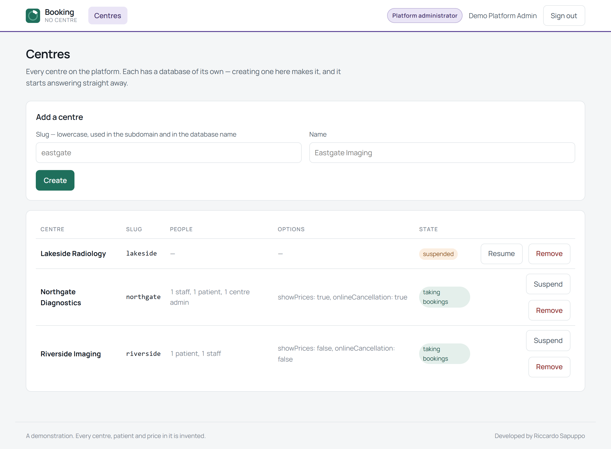
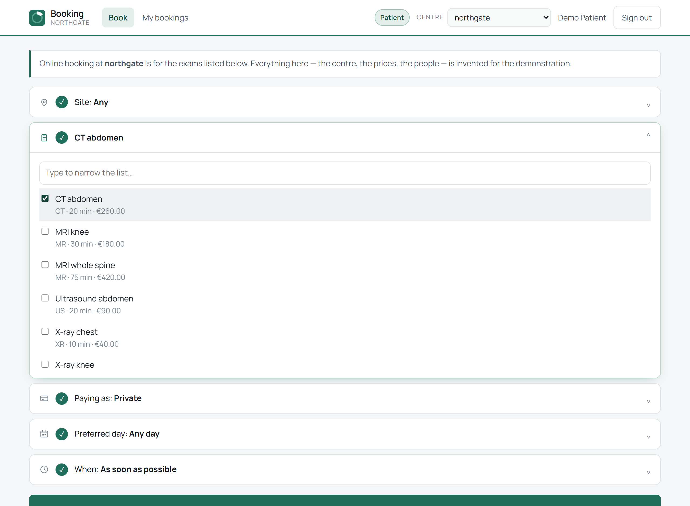
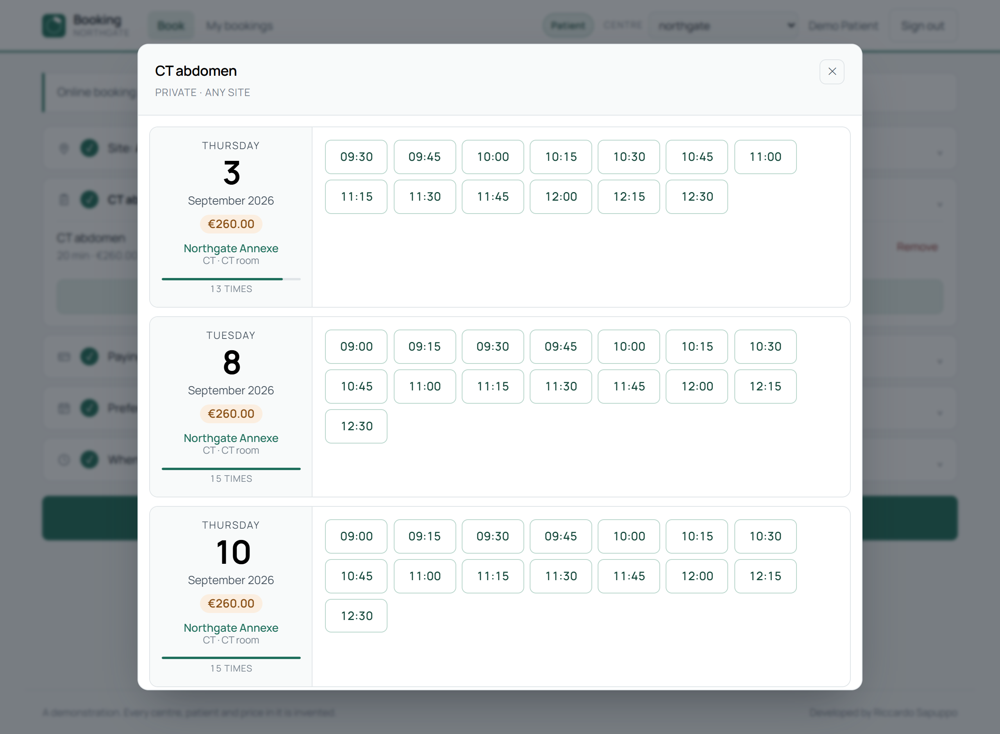
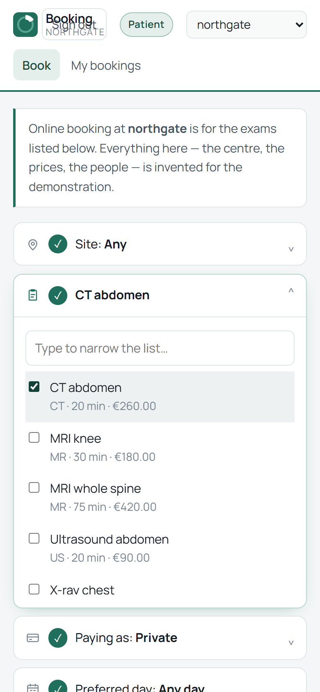
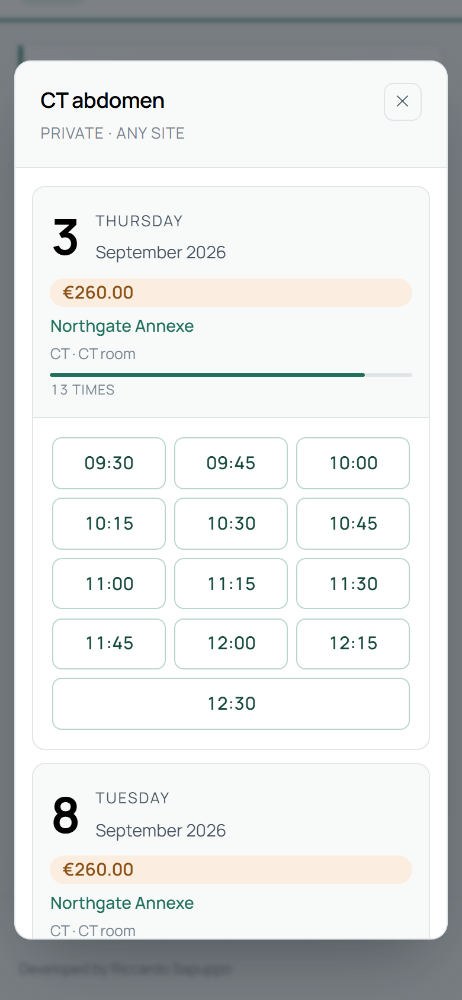
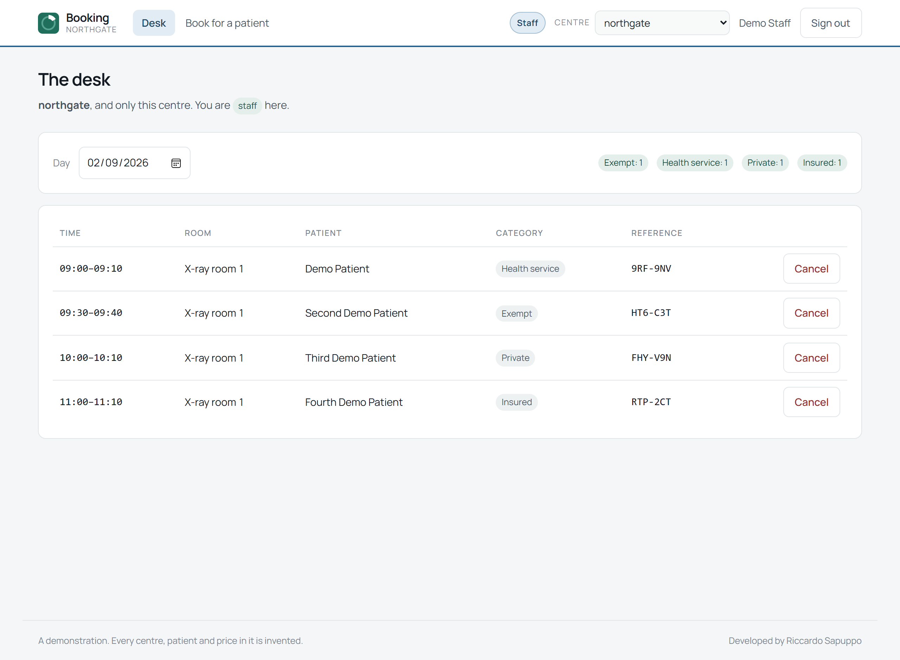
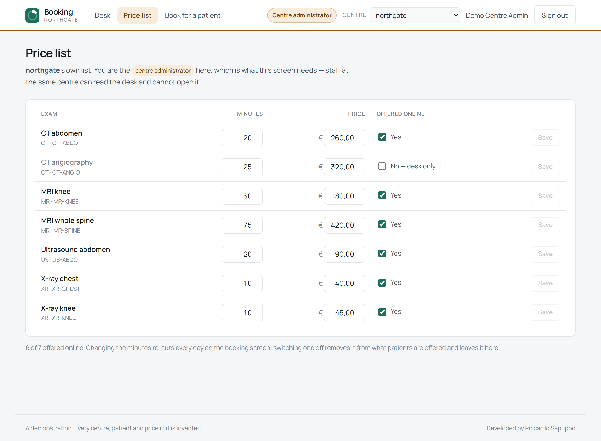

# Multi-tenant booking

A booking platform for a group of diagnostic centres. Patients book online,
the desk works the day's diary, and whoever runs the platform brings a new
centre into existence from a console — while the others carry on taking
bookings.

The interesting part is the last one. Routing three centres that already exist
is a middleware; **creating the fourth, at runtime, with its own database, is
where a multi-tenant system is actually decided** — and it is what this
demonstrates.



## Before you start

**Docker, with the Compose plugin.** That is the whole list. PostgreSQL, the
API and the interface all run in containers, so there is no database to
install, no Angular CLI, no account anywhere and no key.

To run the tests or work on it, **Node.js 20.11 or newer**.

About 400 MB of images and packages, once. Nothing is persisted outside
Docker: the databases live and die with the container, so every start is a
clean one.

## Running it

```
git clone https://github.com/riccardosapuppo/multi-tenant-booking.git
cd multi-tenant-booking
docker compose up --build
```

Then open **http://localhost:4200**. The first start creates the register,
three centres, and the accounts below.

If port 3000 or 4200 is already taken — 3000 is the port every other
development server also wants — set your own:

```
API_PORT=3001 WEB_PORT=4300 docker compose up --build
```

`docker compose down` stops it and takes the data with it.

## Signing in

Four accounts. They are on the sign-in page as buttons, so you can move
between them in a click, and they are printed here because **the difference
between them is the demonstration**. They open a database created empty on
your machine and thrown away with the container.

| Account | Email | Password | What it shows |
|---|---|---|---|
| Patient | `patient@example.invalid` | `patient-demo-1234` | Books at either centre; sees only their own bookings |
| Staff | `staff@example.invalid` | `staff-demo-1234` | The desk at Northgate **and** Riverside, and nothing at Lakeside |
| Centre administrator | `admin@example.invalid` | `centre-admin-demo-1234` | Northgate's desk, and may change its price list |
| Platform administrator | `platform@example.invalid` | `platform-admin-demo-1234` | Creates and suspends centres — and cannot read a single patient booking |

The last row is not an omission. Administering the platform is not permission
to read every record on it, so `platform_admin` is a different job from
`centre_admin` rather than a bigger one. Sign in as it and try the desk: the
API returns 403.

Every claim in that table is checked by `npm run check:roles`, which drives
each account through what it is promised **and** through what it is promised it
cannot do. One of those rows used to be false — see *Checking it*.

### Four accounts, four applications

The header is where a role becomes visible, and it changes completely: its
colour, what it offers, and where signing in puts you. One service, one login,
and the boundary between these four people is a permission rather than four
deployments.

<p>
  <br />
  <br />
  <br />
  
</p>

Read from the top: the patient books and looks at their own appointments; staff
open on today's diary and book on somebody's behalf; the centre's administrator
has the price list as well; and whoever runs the platform has centres and
*nothing else* — no centre selector, because they belong to none, and the word
under the mark says **no centre**.

## What it looks like

Booking, in the shape the original asked the question: panels that open one at
a time, each showing its answer once closed. Several exams go into one visit —
"Add another exam" — and the payment category is asked *before* the times,
because it changes which times exist.



The answer opens over the question that asked for it, and it is **days** rather
than slots: a card per day with the date large, the total price for everything
asked for, the site, and the times beside it. Each day also carries a bar
showing how much choice it offers next to the others — with eight days on
screen the useful question is not "is this one free" but "which of these leaves
me room to change my mind".



And on a phone, where the header becomes two rows and drops the account name —
somebody knows who they signed in as; what they need is which centre they are
looking at.

<p>
  
  
</p>

The desk, which is behind a role at that centre. The totals along the top are
per payment category, because that is what the quotas are counted in:



And the price list, which **only** the centre's own administrator can open —
staff at the same centre read the desk and are sent back to it. None of the
three columns is just a number: minutes is how long a slot is, so changing it
re-cuts every day on the booking screen; *offered online* takes an exam off
what patients are shown and leaves it here; and the price is what somebody is
quoted before they choose a time.



## The five minutes worth spending

1. **Sign in as the patient** and book something at Northgate. Then switch
   centre in the header and look at *My bookings*: it is empty. Nothing was
   filtered out — the booking is in another database and was never fetched.
2. **Sign in as staff.** The *Desk* link appears. Switch to Lakeside and it
   goes: the same account, the same token, a different centre.
3. **Book as an exempt patient at Riverside.** Its morning allows one, so the
   second attempt says the quota for that category is used up — and offers the
   same morning to a private patient. Quotas per payment category are what the
   people at the desk actually manage, and most demonstrations model them away.
4. **Sign in as the platform administrator and create a centre.** It gets a
   database, a schema and a register entry, and answers immediately:

   ```
   curl -H 'X-Centre: eastgate' http://localhost:3000/api/centre/exams
   ```

   No restart, no configuration file, and the other centres never paused.

## How a centre is decided

One shared database holds identity and the register. One database per centre
holds everything clinical. That split is the original's and it is deliberate:

- **A person has one account** and books at whichever centre they like.
  Identity per centre would mean registering again at each one.
- **A query cannot forget its filter** when there is nothing else in the
  database to return. Isolation by `WHERE centre_id = ?` is one missing clause
  away from a leak, and nothing lists the places it has been forgotten.

The cost is real and is not hidden: a schema change has to reach every centre,
and a report across centres has to visit each one. `provision.js` exists
because of the first, and the console pays the second on purpose.

Which centre a request is for is resolved once, at the front, from a header, a
subdomain or a query parameter:

```
curl -H 'X-Centre: northgate' http://localhost:3000/api/centre/exams
curl 'http://localhost:3000/api/centre/exams?centre=riverside'
```

**If two of them disagree the request is refused**, not resolved. A header
naming one centre and a hostname naming another is a misconfiguration or an
attempt, and picking one silently is how a booking lands in the wrong centre's
database.

A suspended centre answers 403 and an unknown one 404 — different answers on
purpose, since a platform that returns the same for both lets anybody
enumerate its centres.

## One application, four jobs

The original had two deployments: a portal, and a separate console for whoever
ran the platform. Separating the jobs was right; separating the *applications*
hid the thing worth showing, which is that the boundary between them is a
permission and not a URL.

So this is one Angular application whose navigation is built from what the
signed-in account may actually do, at the centre it is currently looking at.
Watch the *Desk* link appear and disappear as you switch centres: that is what
"a role is always at a centre" means, and it is more convincing than a
paragraph about it.

Putting them in one application only shows that, though, if signing in as
somebody else visibly changes the application — and at first it did not.
Everybody got the same two links plus perhaps a third, the role was a word
inside the centre selector, and signing out and back in as an administrator
looked identical. So three things move together with the role now: the colour
the header wears, the set of links (not the same links with some hidden — a
patient has *My bookings*, staff *book for a patient*), and where signing in
puts you, because staff do not open this to book themselves an appointment.

## Checking it

```
npm test                     # the rules, and the isolation, if a database is there
npm run walkthrough          # drives the running platform over HTTP
npm run check:screen         # drives the whole journey through a browser
npm run check:roles          # every account against every claim made about it
npm run check:serving        # nothing here can hand somebody yesterday's build
npm run check:mark           # the header mark and the tab icon are one drawing
```

The three `check:` scripts that drive a browser want `playwright-core` on the
path; they say so and stop rather than pretending to have passed. They are
checks, not dependencies, so they are not in `package.json`.

The suite covers the rules — quotas, slot cutting, weekday patterns — and,
when PostgreSQL is reachable, creates two centres of its own to check that
neither can see the other. With no database those skip rather than fail; CI
provides one, and then checks that nothing skipped.

`npm run walkthrough` is the check that is **not** written behind the same door
as the code. The suite calls the functions directly and was written alongside
them, which makes it good at saying they still do what they did and blind to a
route mounted in the wrong place or a permission check on a router that never
runs. This drives the running platform through the whole story — resolving,
booking, isolation, permissions, provisioning — and states what should happen
before each step, so a failure reads as a sentence:

```
A role is never enough on its own
  ok    a patient cannot read the diary
  ok    staff can read the diary where they work
  ok    and not at a centre they do not work at
  ok    the platform administrator cannot read a patient diary
```

### And a check at one layer cannot see the next one down

Three layers, because each is blind to the one above it, and every one of them
has caught something the others could not.

`npm run check:screen` drives the whole journey with a browser: a patient books
and reads the reference off the screen, signs out, and staff sign in and find
that appointment on the desk with the right name, time, room and category.
Everything it does the walkthrough already does over HTTP — and that is a
different claim. The API behaving is not somebody being able to do it. It found
three screens that did not reload when the centre was switched, so one centre's
appointments sat under another centre's name, and a centre that survived
signing out.

`npm run check:roles` takes the table under *Signing in* and treats it as a
promise. It found the row that was false: it said the centre's administrator
"may change its price list", and `PATCH /desk/exams/:id` existed, was guarded
correctly and had a passing test — with no screen anywhere that called it. True
of the system, false of the interface, which is the only place a person can
act.

`npm run check:serving` is about what a browser is handed. An earlier version
of this project installed a service worker; a service worker outlives the build
that registered it, is reached before the network, and keeps serving its own
precached copy — so opening the site returned a page from weeks ago and only
Ctrl+F5 got past it. The way a browser gives up on one is by re-fetching its
files and finding them gone, and `try_files $uri $uri/ /index.html` answered
`/ngsw.json` with 200 and a page of HTML. **A request that names a file and
does not find one must be a 404, never the application.**

## Where things are

```
backend/
  tenants/      the register, resolving a request to a centre, and provisioning
  db/pools.js   the only file that turns "which centre" into "which database"
  auth/         passwords, sessions, and permissions that always carry a centre
  booking/      availability as pure functions, and the diary
  centre/       the desk: behind a role at this centre
  platform/     the console: behind platform_admin, no tenant resolved
  sql/          the register's schema, and the template every centre is made from
web/src/app/    one application: book, desk, console
tools/          the walkthrough
```

## What this is not

The demonstration data is invented — every centre, patient, price and opening
hour. There is no payment, no email, no calendar file, and no integration with
a practice management system; the original had all of those and they are the
parts that cannot run on somebody else's machine.

The session token is kept in `localStorage`, which is readable by any script
that gets onto the page. The production answer is an httpOnly cookie with a
CSRF token; here the whole platform is a container on your own machine and the
trade-off is written where it is made rather than glossed over.

---

Developed by Riccardo Sapuppo. MIT licensed.
