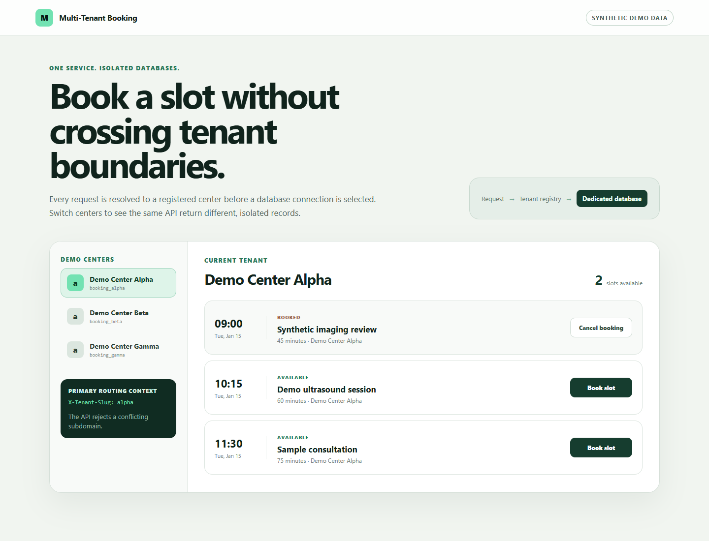

# Multi-Tenant Booking

One Express service routes each request to a dedicated tenant database. The request cannot choose a database directly: a tenant slug is resolved against a PostgreSQL registry first, then a connection registry returns the pool assigned to that immutable tenant ID.

```text
X-Tenant-Slug / subdomain
            │
            ▼
     tenant resolver ─── rejects conflicting contexts
            │
            ▼
 PostgreSQL registry ─── tenant ID + approved database name
            │
            ▼
  connection registry
       ┌────┼────┐
       ▼    ▼    ▼
    Alpha  Beta  Gamma
    database database database
```

All four databases run in one PostgreSQL container: one registry and three isolated booking databases. The original application used PostgreSQL for its own registry and SQL Server for the centers it integrated with. This demo deliberately uses PostgreSQL for both roles, avoiding a large second database image and making the multi-tenant mechanism practical to run on Windows, macOS, Linux and Apple Silicon.

The original was built for a client and lives in a private repository. This is an independent reimplementation, written from scratch with synthetic data.



## Before you start

**To run the demo, Docker with the Compose plugin is the only requirement.**
The API and the web application are built inside their own images and all four
databases run in one `postgres:16-alpine` container: there is no PostgreSQL to
install, no Angular CLI, no global anything, and no account anywhere. `npm
start` is a one-line shortcut for `docker compose up --build`, so even Node is
optional if you run that directly.

**To run the tests or work on it**, Node.js 20.11 or newer and npm 10 or newer,
plus `npm install` — about 250 MB of packages.

Nothing is persisted outside Docker: the databases live and die with the
container, so every start is a clean one. `docker compose down --rmi local`
removes the two images built here and puts the machine back.

## Run the complete demo

```bash
git clone https://github.com/riccardosapuppo/multi-tenant-booking.git
cd multi-tenant-booking
npm install
npm start
```

`npm start` is the only startup command. It builds the Angular web application and Express API, starts PostgreSQL, creates the registry and tenant databases, applies every tenant migration and loads conspicuously synthetic records. Open [http://localhost:4200](http://localhost:4200).

The credentials in `docker-compose.yml` are fixed, public demo values. They protect nothing and must not be reused outside this disposable local stack.

## Resolve a tenant

The portable route is the `X-Tenant-Slug` header. It works without DNS or hosts-file changes:

```bash
curl -H "X-Tenant-Slug: alpha" http://localhost:4200/api/state
curl -H "X-Tenant-Slug: beta" http://localhost:4200/api/state
curl -H "X-Tenant-Slug: gamma" http://localhost:4200/api/state
```

Clients that resolve `*.localhost` can alternatively request `http://alpha.localhost:4200/api/state` without the header. This is secondary because wildcard localhost behavior varies, notably in Safari and on systems that require explicit hosts-file entries.

When both forms are present they must agree. A request for `beta.localhost` carrying `X-Tenant-Slug: alpha` is rejected instead of silently choosing one context.

## What the repository proves

- The registry, not request input, decides which database name is allowed.
- Connection pools are cached by immutable tenant ID and refuse a changed database mapping at runtime.
- A single migration runner enumerates every active tenant and records the versions applied to each database.
- Booking is atomic: concurrent callers cannot reserve the same available slot twice.
- Booking and cancellation always receive a resolved tenant before reaching persistence.
- Alpha, Beta and Gamma intentionally contain `slot-shared` and `booking-shared`; automated tests prove that identical IDs still return tenant-specific records.

The Angular interface makes the boundary visible by showing the active header, database alias and different data for each demo center. Its service worker caches only static application assets. API reads and mutations are never cached.

## Fast isolation tests

```bash
npm test
npm run build
```

Tests do not require Docker or a network service. They create three separate SQL.js databases in-process, run the same migrations and persistence layer used by the API, then exercise Express through HTTP. The suite covers identical IDs, cross-tenant reads, header routing, optional subdomains, host/header conflicts, unknown tenants, migration coverage, atomic reservation and isolated cancellation.

The CI workflow runs `npm ci`, `npm run build` and `npm test` on every push and pull request.

## Deliberate limits

Tenant resolution is routing, not authorization. This demo lets a caller select a synthetic tenant so the mechanism is easy to inspect. In production, `X-Tenant-Slug` must be set by a trusted gateway and checked against the authenticated identity; accepting it directly from an untrusted client would allow tenant switching.

After all non-major production fixes, `npm audit --omit=dev` retains six high-severity Angular 19 package findings; the two advisories attached directly to `@angular/core` are **Client Hydration DOM Clobbering & Response-Cache Poisoning** and **Angular i18n XSS via event-handler attributes**, and clearing the remaining Angular findings requires a deliberate migration to Angular 22.

The repository intentionally excludes patient identities, health records, SSN and prescription flows, payments, Wallet passes, email, notifications and integration with a real management system. It also omits a tenant-provisioning UI, per-tenant schema customization, offline booking mutations, high availability, backups, distributed pool invalidation and concurrent migration coordination. Those features would enlarge the product without strengthening the database-routing demonstration.

The three centers, services, timestamps and bookings are synthetic. The project is an architectural demo, not a production appointment system or a security-audited authorization layer.

## Project map

- `apps/api` contains tenant resolution, domain services, PostgreSQL adapters and HTTP endpoints.
- `apps/web` contains the Angular interface and Nginx reverse-proxy configuration.
- `database/postgres` creates the registry and three tenant databases.
- `packages/contracts` holds the transport types shared by browser and API.
- `tests` contains the Docker-free isolation harness and integration suite.

## License

MIT — see [LICENSE](LICENSE).
